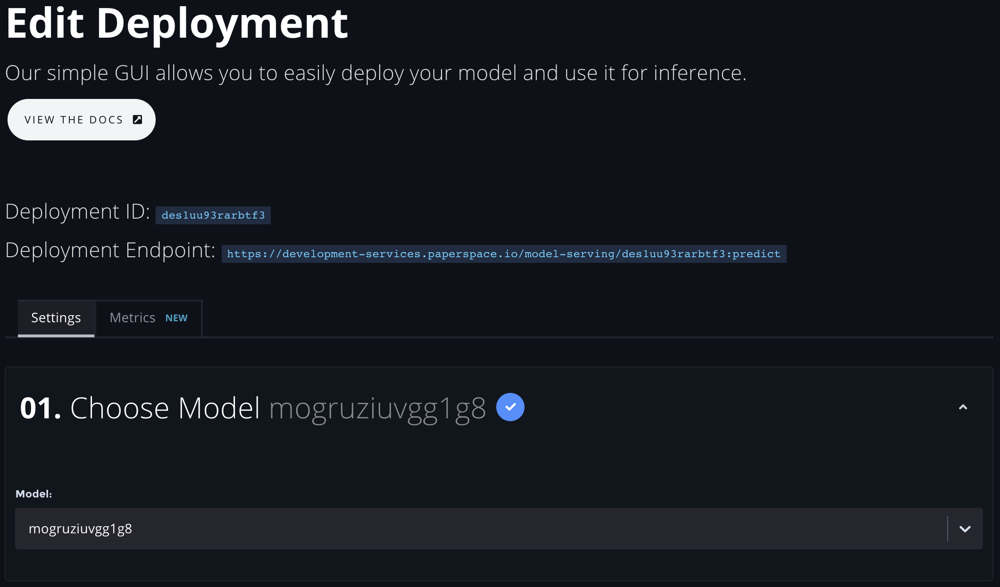

# Updating Deployments

## Edit a Deployment

You can edit a Deployment's attributes, such as the underlying model, the Deployment's name, instance count, etc.


Changes to a running Deployment other than **name** are not possible when the Deployment is running.


To edit a Deployment, navigate to the **Deployments** page, find the Deployment you want to edit, and click **Edit** in the Actions column:

This will launch the Edit Deployment flow, which is nearly the same as the Create Deployment flow. The differences are that the Edit Deployment flow will display the **Deployment ID**, the **Deployment Endpoint**, and will always allow you to **Choose a Model**; and it will _not_ display the **Create Active Deployment** toggle. \(If you want to edit and start a stopped Deployment, save your changes and then click **Start** back on the Deployments page.\)

Besides those differences, you can edit any of the other values of your Deployment just like you did in the Create Deployment flow.

When you are done and want to save your changes, click **Edit Deployment** at the bottom:

