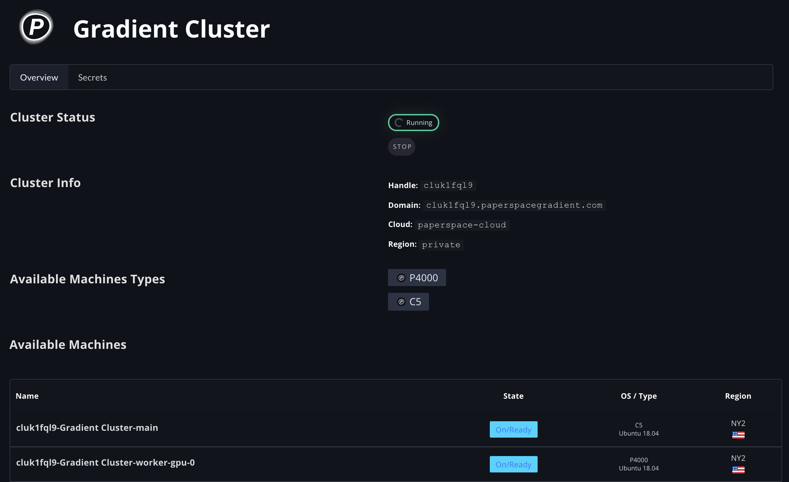
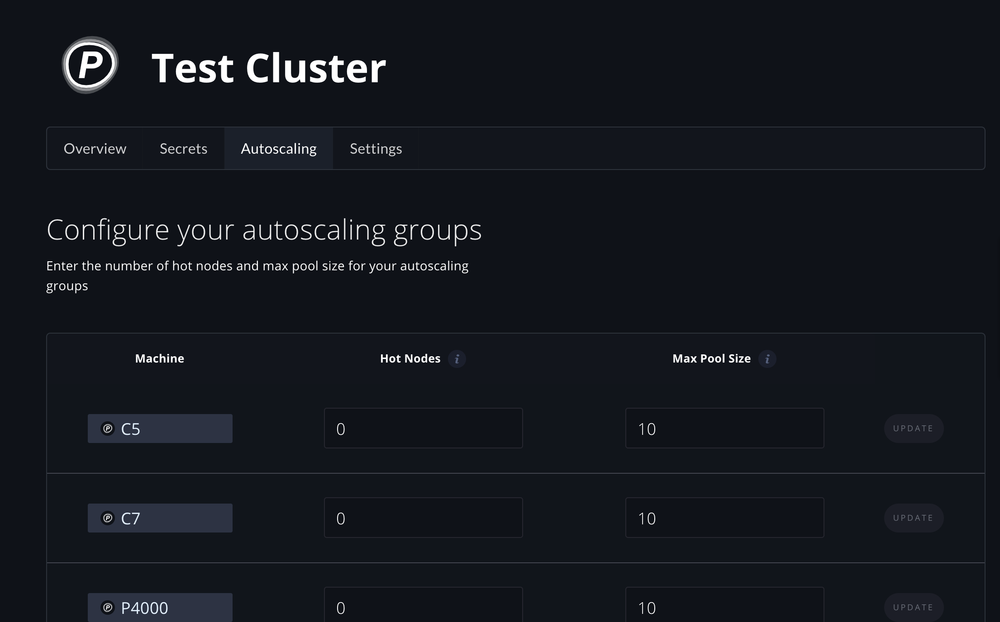

# Managed Private Clusters

## What is a managed private cluster?

Managed clusters provide a dedicated Kubernetes cluster hosted on the Paperspace cloud. They are a single-tenant \(fully isolated\) environment that provides more flexibility, features, and control than the default public cluster. 

## Overview

Gradient clusters can be created in just a few clicks in the Web UI. Create and run notebooks, experiments, and deployments all in your private cluster from within the Web UI, from the CLI, or using the SDK.

On this page, you'll learn how to create a managed cluster and view your managed clusters from the Web UI.


**Note:** Managed clusters run on the Paperspace cloud. If you are looking to create a _self-hosted_ Gradient cluster, see the [Gradient Installer CLI](self-hosted-clusters/gradient-installer-cli.md).


## Create a managed cluster

### 1. In the Gradient product menu, select **Clusters**

### 2. Select Create managed cluster

### 3. Configure your managed cluster

Select the Paperspace Cloud region where your machines will be provisioned. Then select **Create Cluster.**

Note: cost for the Kubernetes cluster itself is $0.12/hour. You can delete your cluster at any time to stop accruing charges. 

### **4. Cluster provisioning**

You should now see that your cluster is provisioning!

This process may take up to 10 minutes of time -- so be prepared to take a quick stretch and grab a coffee.

### 5. Your first managed cluster

When your cluster is successfully provisioned, you will see the new machines now available for your use.

Once provisioning is completed, the new cluster will appear everywhere in the Web UI that you can select a cluster, including:

* Running notebooks 
* Creating experiments and jobs
* Creating deployments
* Creating a storage provider to connect data
* ... and more!

From the **Clusters** view, you now have access to your cluster and machine details and can Start and Stop your cluster machines manually as needed.

## View your Managed Clusters

Once you've created any number of managed clusters, you can view them on the same Private Clusters page.

## Autoscaling Groups

Managed private clusters utilize autoscaling groups so that only the machines you need are active when you need them. Autoscaling groups can be configured by viewing your private cluster.

Each autoscaling group has the following:

* Machine - this is the machine type that the autoscaling group will manage
* Hot Nodes - standby machines that are on at all times and can process Gradient workloads immediately
* Max Pool Size - Maximum amount of machines that can be created by autoscaling. This value is limited by your account's maximum machine count

Default autoscaling machine types: C5, C7, C10, P4000, P5000, V100

