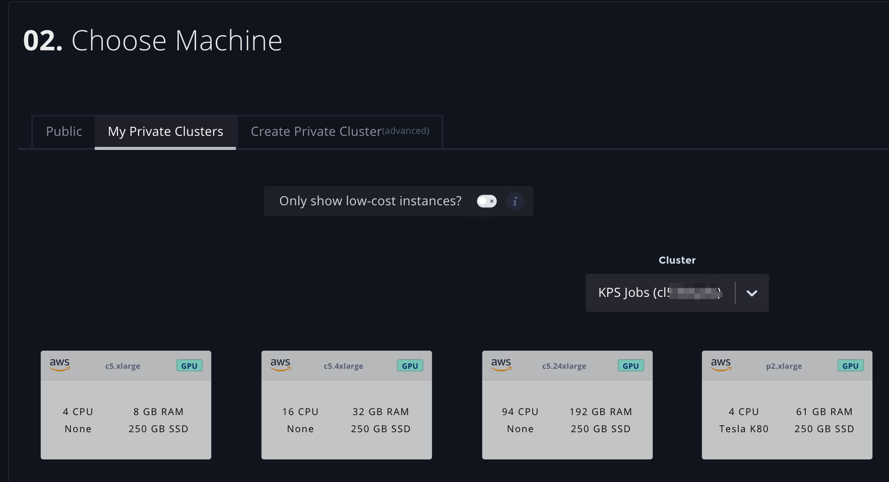

# Usage

## Finding your Cluster ID

Your clusters are available under the _Private Clusters_ [page](https://www.paperspace.com/console/clusters) in the Paperspace console.  Here you can find information about your cluster, including your cluster ID – you will need to specify this ID in order to designate your private cluster as the place to run experiments, notebooks, etc. 


## **Using Gradient private clusters via the Gradient CLI**

```bash
gradient <command> ... --clusterId <your-cluster-ID>
```

`--clusterId string` Cluster ID for this processing site, e.g. "clxxxxxxx". 


You will need to provide your API key to authenticate your requests. Learn how to obtain and set your API key [here](../get-started/install-the-cli.md#obtaining-an-api-key).


A complete example of utilizing Gradient features on a cluster might look like this:

```bash
gradient experiments run singlenode --name experiment1 \
--projectId prgydf45k \
--clusterId cl53waq2x \
--machineType c5.xlarge \
--container tensorflow/tensorflow:1.13.1-py3 \
--experimentEnv "{\"EPOCHS_EVAL\":\"5\",\"TRAIN_EPOCHS\":\"10\",\"MAX_STEPS\":\"1000\",\"EVAL_SECS\":\"10\"}" \
--workspaceUrl https://github.com/Paperspace/mnist-sample.git \
--command "pip install -r requirements.txt && python mnist.py"
```

In order to run workloads on your Gradient cluster, you must specify the `clusterID` parameter on most Gradient primary commands, including:

* experiments
* deployments
* jobs
* models
* notebooks
* tensorboards

If you don't supply the `clusterId` parameter, then your command will default to run on Paperspace instances, which are not part of your private cluster environment.

To avoid having to re-enter the Cluster ID, and if you want the configuration to be reusable and checked into source control, another option is using the [Gradient Config File](../experiments/using-experiments/gradient-config.yaml.md). This file can contain the `clusterID` parameter in addition to many other common settings.

## **Using Gradient clusters via the Web UI**

When creating a notebook, an experiment, or a model deployment, select your private cluster in the console, then select an instance type that's available in your cluster.



