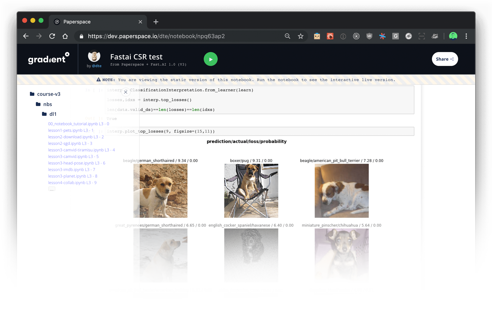

# Overview

## What is a Notebook?

Gradient notebooks are an interactive environment \(based on [Jupyter Notebook](https://jupyter.org/) or [Jupyter Lab](https://blog.jupyter.org/jupyterlab-is-ready-for-users-5a6f039b8906)\) for developing and running code. You can run Jupyter notebooks on a GPU, CPU, or even a TPU. 

A Gradient ****Notebook gives you access to a full Jupyter Notebook environment. Within the Notebook, you can store an unlimited number of documents and other files. You can think of a Gradient Notebook as your persistent, on-demand workspace in the cloud.


**NEW!**  Visit the new [ML Showcase](https://ml-showcase.paperspace.com/) for a list of sample projects you can fork into your own account.


## File Storage

Any data stored in `/storage` will be preserved for you, across restarts. Persistent storage is backed by a filesystem and is ideal for storing data like images, datasets, model checkpoints etc.  Learn more about persistent storage [here](../data/storage/#persistent-storage).

## Containers

Because everything is running in a Docker container behind the scenes, we support any kernel you would like. We have a handful of pre-built containers and you can easily add a custom container or build one from a base template, such as the Jupyter R stack.  

View the list of pre-built containers [here](notebook-containers/).

## Environment Variables

There are a number of environment variables loaded into a notebook's environment, which you can access and use. Probably most common is is `PS_API_KEY` , which will contain your most recently created API key \(if you've created one\). In combination with the Gradient SDK, this allows you to programmatically interact with Gradient.

