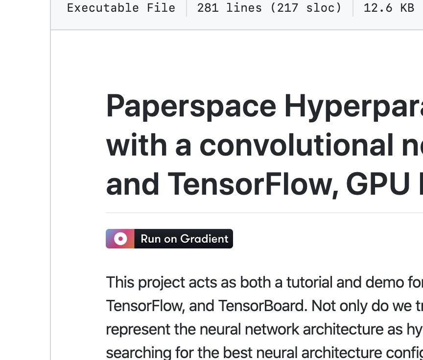
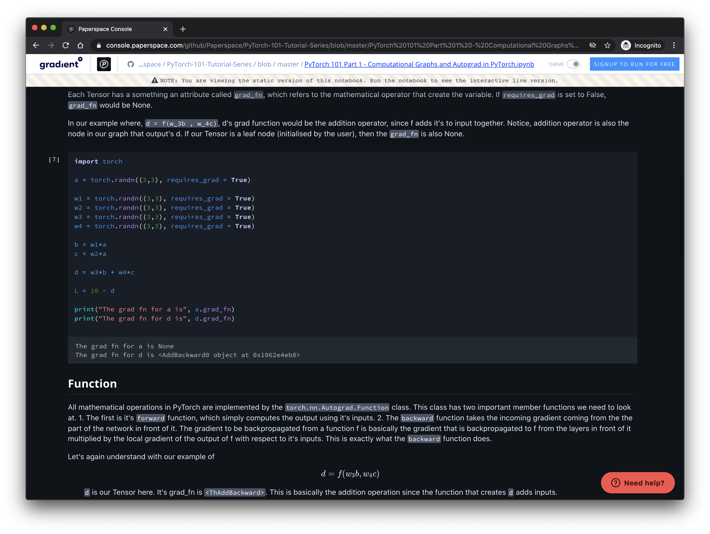
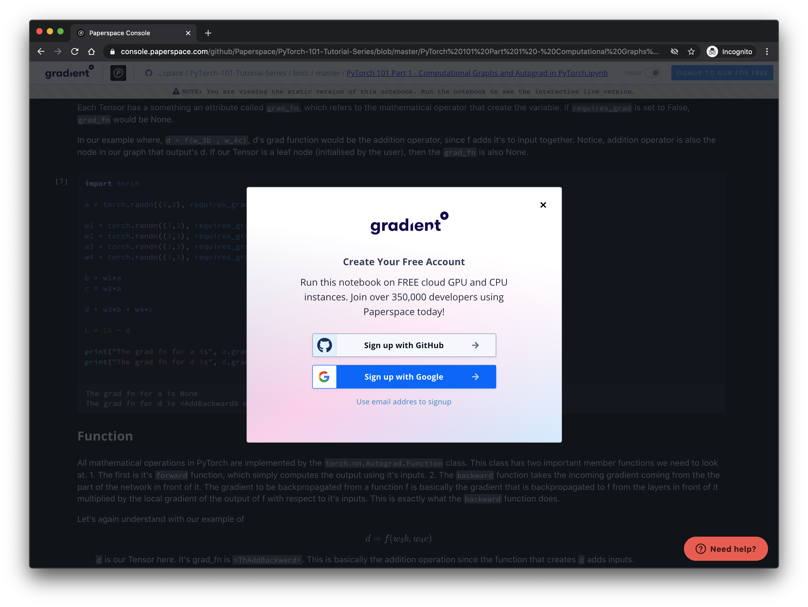

# GitHub Badge - Run on Gradient




## How it Works

The "Run on Gradient" badge allows you to run a Gradient Notebook from any GitHub repository.





## Using the "Run on Gradient" badge

Simple add the following code snippet to your `Readme.md` on your public GitHub repo:

```text
[](https://console.paperspace.com/github/huggingface/nlp/blob/master/notebooks/Overview.ipynb?runtime=tf1.5)
```

Notes:

**Workspace**: This must be a `.ipynb` file. When you click a notebook in a GitHub repo you will can copy the url. When you launch a new notebook from this button you will be able to pull in the entire GitHub repo as well as the individual `.ipynb` files.

**Runtime** You can optionally specify a container to run this workspace in. You can point to any public Docker container by appending `?runtime=paperspace/fastai` where you replace `paperspace/fastai` with your container name.

### Does this work with private GitHub repos?

Currently the 1-click "launch on gradient" button will only work with public GitHub repositories. If you would like to use a private GitHub repository or a container that is in a private registry, you can do so but you need to go to the "Create Notebook" page in the Paperspace Console.

### Where can I find the "Run on Gradient" Badge

The badge can be found here: [https://assets.paperspace.io/img/gradient-badge.svg](https://assets.paperspace.io/img/gradient-badge.svg) . 

It looks like this:


