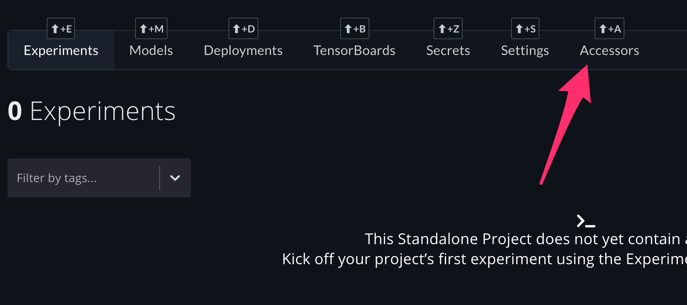

# Managing Projects

## Create a Standalone Project



On the [Projects page](https://console.paperspace.com/projects), click _Create Project_ and select _Create Standalone Project_.


Provide a name and then click _Create Project_.





The following command creates a Project called `ExampleProject` 

```
gradient projects create --name ExampleProject [OPTIONS]
```

#### Parameters: 

| Option | Description |
| :--- | :--- |
| `--name` | Name of new project \[required\] |
| `--repositoryName` | Name of the repository |
| `--repositoryUrl` | URL to the repository |
| `--apiKey` | Key to use this time only |
| `--help`  | Help for this feature |



## Create a GradientCI Project



[GradientCI](gradientci-v2/) Projects allow you to connect a GitHub repository to your Project in order to automatically run experiments when you push new commits or open pull requests \(PRs\).

Visit [https://console.paperspace.com/projects](https://console.paperspace.com/projects), click _Create Project_, and select **Create GradientCI Project**. Make sure you have installed **GradientCI** on the target repository to which you'll link your Project.


If you haven't yet connected your GitHub account, follow the prompts to grant access to your GitHub repositories and to your GradientCI App installation:


Then, select the GitHub repo from the dropdown list:





[GradientCI](gradientci-v2/) Projects allow you to connect a GitHub repository to your Project in order to automatically run experiments when you push new commits or open pull requests \(PRs\).

Make sure you have installed **GradientCI** on the target repository to which you'll link your Project.


The following command creates a Project called `ExampleProject` 


```bash
gradient projects create --name ExampleProject --repositoryName <name> --repositoryUrl <url>
```

#### Parameters: 

| Option | Description |
| :--- | :--- |
| `--name` | Name of new project \[required\] |
| `--repositoryName` | Name of the repository |
| `--repositoryUrl` | URL to the repository |
| `--apiKey` | Key to use this time only |
| `--help`  | Help for this feature |



## Get Your Project's ID

A Project's ID is a required parameter for several commands within Gradient.



To find the ID, click any Project in the Projects List to navigate to its Project Details page, and then click the Project ID to copy the value to your clipboard:





To get a Project ID, you can use the following command:

```bash
gradient projects list
```



## Managing access to a Project

To add other team members to a project, click any Project in the projects list to navigate to its Project details page and then click the Accessors tab:



On the Accessors tab you will find a list of users who already have access to the Project. Add an Accessor by clicking the "Add Accessor" button on the right side of the page. Assign other team members to the Project by selecting their name in the drop-down and clicking on "Assign User":


You can also remove members' access to a Project by clicking the "Remove Access" button next to the member's name.


Note: Only existing team members will be displayed in the drop-down list. Only Team admins can add additional team members to this list.

Additionally, project access can only be controlled through the web console – Accessors cannot be added or removed through the Gradient CLI.


## Deleting a Project



You can delete a project by visiting the project's `Settings` page and hitting the `Delete Project` button.  





To delete a Project, you can use the following command:

```bash
gradient projects delete --id <project id>
```



