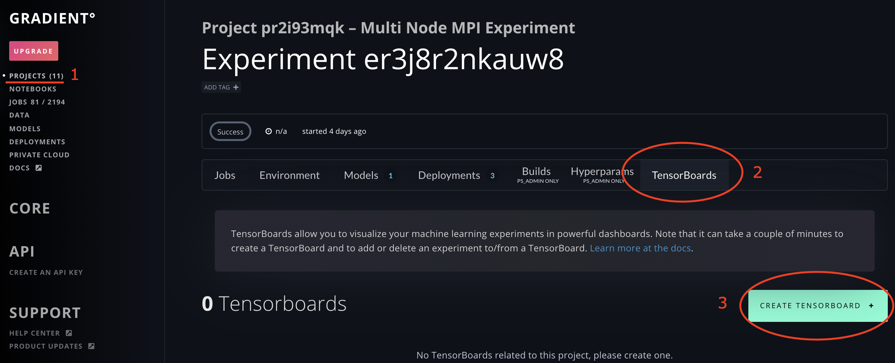

# Using TensorBoards via the GUI

Gradient Enterprise customers are able to create TensorBoards, add experiments to them, and remove experiments from them. You can do this via the GUI [or the CLI](tensorboard-cli.md).

TensorBoards are currently associated with experiments directly, though TensorBoards as a first-class concept in the Gradient GUI is coming soon.

From any Experiment Details view, you can add any experiment, across all team projects, to any TensorBoard.

You'll see all of your team's TensorBoards listed under any Experiment Details view, though you can filter TensorBoards down only to show the ones that contain Experiments from within the current Project.

#### Create a TensorBoard

To create a TensorBoard, whether your team already has multiple or has none, 1\) navigate to **Projects** and click into any Experiment to see its Details page; 2\) click **TensorBoards**; and 3\) click **Create TensorBoard +**.

Clicking **Create TensorBoard +** will launch the following modal, where you can add a Name for your TensorBoard, as well as optional Username and Password for basic authentication. Then click **Create TensorBoard**.

By default, if you have zero TensorBoards, the current experiment will be automatically added to your first TensorBoard.

You can then see a mapping between the current Experiment \(the one whose Details page you're working from\) and all TensorBoards, with the **Experiment Status** in relation to each TensorBoard, as well as the **name** and **ID** of each of your team's TensorBoards, and that TensorBoard's status.

Note that although you can technically add an Experiment that has not completed, or that has failed, to a TensorBoard, it will not be complete **Adding** to a given TensorBoard until that Experiment has completed.

If a TensorBoard has had Experiments added to it, simply click Launch to open the TensorBoard and view the resultant visualizations.

#### Adding and Removing Experiments to/from TensorBoards

You can manually **Add** or **Remove** an experiment from a TensorBoard by clicking the green toggle under Experiment Status. In other words, if you wish to _add_ an Experiment to a TensorBoard \(thus including it on that TensorBoard\), click the Experiment Status toggle to be active / green / to the right.To _remove_ an Experiment from a TensorBoard, click the toggle to be inactive / gray / to the left.

